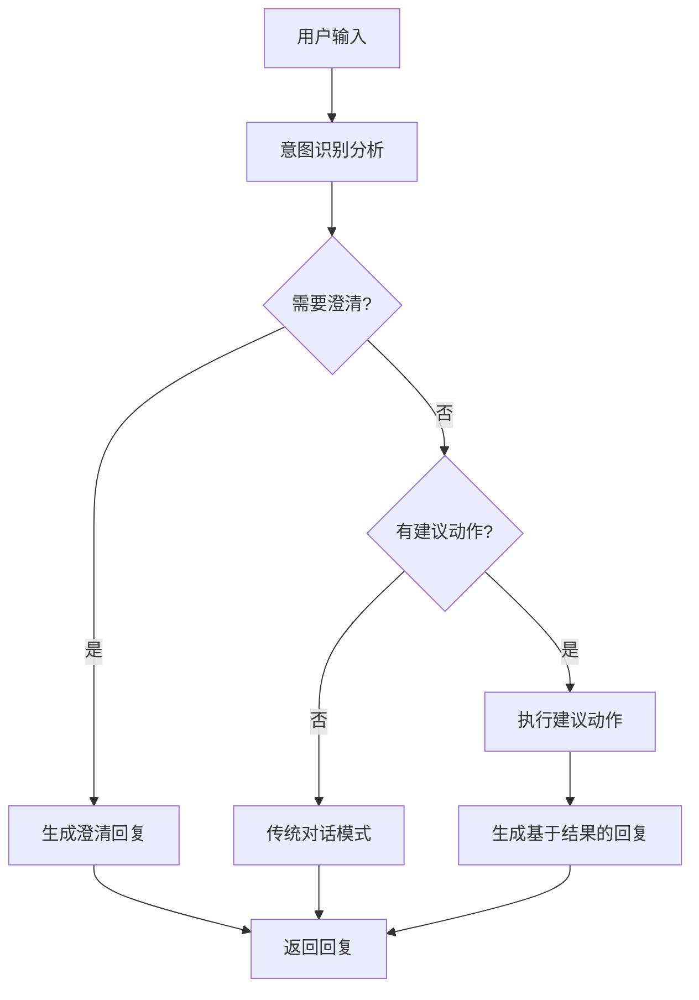

# Agent意图识别系统指南

## 概述

我们的Agent模块现在支持高级意图识别功能，可以通过智能分析用户输入来自动调用普通工具、MCP工具或触发工作流。这个系统大大提升了Agent的智能化程度和用户体验。

## 🎯 核心功能

### ✅ 已实现的功能

1. **多层次意图识别**
   - 基础模式：仅支持工具调用
   - 高级模式：支持工具+MCP工具+工作流
   - 工作流专用模式：仅支持工作流触发

2. **智能动作执行**
   - 自动调用普通工具
   - 自动调用MCP工具
   - 自动触发工作流执行
   - 支持参数提取和传递

3. **上下文感知**
   - 对话历史分析
   - 参数提取和验证
   - 澄清机制

4. **回退机制**
   - 传统对话模式回退
   - 多层错误处理
   - 用户友好的错误提示

## 🏗️ 系统架构

### 意图识别流程



### 核心组件

1. **IntentRecognitionService** (集成在AgentService中)
   - 意图分析和识别
   - 参数提取
   - 动作推荐

2. **ActionExecutionService** (集成在AgentService中)
   - 工具调用执行
   - MCP工具调用执行
   - 工作流触发执行

3. **ResponseGenerationService** (集成在AgentService中)
   - 基于执行结果生成回复
   - 澄清回复生成
   - 错误处理回复

## 📋 配置选项

### 意图识别模式

```typescript
export enum IntentRecognitionMode {
  DISABLED = 'disabled',           // 禁用意图识别
  BASIC = 'basic',                // 基础意图识别（仅工具调用）
  ADVANCED = 'advanced',          // 高级意图识别（工具+MCP+工作流）
  WORKFLOW_ONLY = 'workflow_only' // 仅工作流意图识别
}
```

### 配置接口

```typescript
interface IntentRecognitionConfig {
  mode: IntentRecognitionMode;
  confidenceThreshold: number;        // 置信度阈值 (0-1)
  enableParameterExtraction: boolean; // 是否启用参数提取
  enableContextHistory: boolean;      // 是否使用对话历史
  maxHistoryLength: number;          // 最大历史长度
  fallbackToTraditional: boolean;    // 是否回退到传统模式
  enabledActionTypes: Array<'tool' | 'mcp_tool' | 'workflow'>;
  customIntentCategories?: Array<{   // 自定义意图类别
    id: string;
    name: string;
    description: string;
    keywords: string[];
    actionType: 'tool' | 'mcp_tool' | 'workflow';
    actionId: string;
    requiredParameters?: string[];
  }>;
}
```

## 🚀 使用示例

### 1. 创建支持意图识别的Agent

```typescript
const smartAgent = {
  name: "智能助手",
  description: "具备高级意图识别能力的智能助手",
  llmParams: {
    model: "gpt-4",
    temperature: 0.7,
    maxTokens: 2000
  },
  intentRecognition: {
    mode: IntentRecognitionMode.ADVANCED,
    confidenceThreshold: 0.8,
    enableParameterExtraction: true,
    enableContextHistory: true,
    maxHistoryLength: 15,
    fallbackToTraditional: true,
    enabledActionTypes: ['tool', 'mcp_tool', 'workflow']
  },
  enabledTools: ["file-processor", "calculator"],
  enabledMcpTools: ["web-search:search", "database:query"],
  enabledWorkflows: ["data-analysis", "code-generation"]
};

const agent = await agentService.create(smartAgent, user);
```

### 2. 测试意图识别

```typescript
const testResult = await fetch('/api/agents/{agentId}/test-intent-recognition', {
  method: 'POST',
  headers: {
    'Authorization': 'Bearer <token>',
    'Content-Type': 'application/json'
  },
  body: JSON.stringify({
    message: "帮我分析一下这个月的销售数据",
    conversationHistory: [
      { role: "user", content: "你好" },
      { role: "assistant", content: "您好！有什么可以帮您的吗？" }
    ]
  })
});

const result = await testResult.json();
console.log('意图识别结果:', result);
```

### 3. 进行智能对话

```typescript
const chatResult = await fetch('/api/agents/{agentId}/conversations/{conversationId}/chat', {
  method: 'POST',
  headers: {
    'Authorization': 'Bearer <token>',
    'Content-Type': 'application/json'
  },
  body: JSON.stringify({
    message: "帮我搜索最新的AI技术发展"
  })
});

const response = await chatResult.json();
console.log('对话结果:', response.message);
console.log('执行的动作:', response.actionResults);
```

## 📊 意图识别示例

### 数据分析意图

**用户输入**: "帮我分析一下这个月的销售数据"

**识别结果**:
```json
{
  "recognizedIntents": [
    {
      "intentId": "data_analysis",
      "intentName": "数据分析",
      "confidence": 0.92,
      "reasoning": "用户明确要求进行数据分析"
    }
  ],
  "primaryIntent": {
    "intentId": "data_analysis",
    "intentName": "数据分析",
    "confidence": 0.92
  },
  "extractedParameters": {
    "data_source": "sales_data",
    "time_period": "this_month",
    "analysis_type": "general"
  },
  "needsClarification": false,
  "suggestedActions": [
    {
      "actionType": "workflow",
      "actionId": "data-analysis-workflow",
      "actionName": "数据分析工作流",
      "description": "执行销售数据分析",
      "parameters": {
        "data_source": "sales_data",
        "time_period": "this_month"
      }
    }
  ]
}
```

### 网络搜索意图

**用户输入**: "搜索一下最新的AI技术发展"

**识别结果**:
```json
{
  "recognizedIntents": [
    {
      "intentId": "web_search",
      "intentName": "网络搜索",
      "confidence": 0.88,
      "reasoning": "用户要求搜索网络信息"
    }
  ],
  "primaryIntent": {
    "intentId": "web_search",
    "intentName": "网络搜索",
    "confidence": 0.88
  },
  "extractedParameters": {
    "query": "最新的AI技术发展",
    "search_type": "general"
  },
  "needsClarification": false,
  "suggestedActions": [
    {
      "actionType": "mcp_tool",
      "actionId": "web-search:search",
      "actionName": "网络搜索工具",
      "description": "搜索最新AI技术信息",
      "parameters": {
        "query": "最新的AI技术发展"
      }
    }
  ]
}
```

## 🔧 高级配置

### 自定义意图类别

```typescript
const customIntentConfig = {
  mode: IntentRecognitionMode.ADVANCED,
  confidenceThreshold: 0.8,
  enableParameterExtraction: true,
  enableContextHistory: true,
  maxHistoryLength: 15,
  fallbackToTraditional: true,
  enabledActionTypes: ['tool', 'mcp_tool', 'workflow'],
  customIntentCategories: [
    {
      id: 'customer_service',
      name: '客户服务',
      description: '处理客户咨询和问题',
      keywords: ['客户', '问题', '咨询', '投诉', '服务'],
      actionType: 'workflow',
      actionId: 'customer-service-workflow',
      requiredParameters: ['issue_type', 'customer_info']
    },
    {
      id: 'document_processing',
      name: '文档处理',
      description: '处理文档相关操作',
      keywords: ['文档', '文件', '处理', '转换', '生成'],
      actionType: 'tool',
      actionId: 'document-processor-tool',
      requiredParameters: ['document_type', 'operation']
    }
  ]
};
```

### 专业领域Agent配置

```typescript
// 数据分析师Agent
const dataAnalystConfig = {
  name: "数据分析师",
  description: "专业的数据分析和可视化助手",
  intentRecognition: {
    mode: IntentRecognitionMode.ADVANCED,
    confidenceThreshold: 0.85,
    enableParameterExtraction: true,
    enableContextHistory: true,
    maxHistoryLength: 20,
    fallbackToTraditional: false,
    enabledActionTypes: ['tool', 'workflow'],
    customIntentCategories: [
      {
        id: 'statistical_analysis',
        name: '统计分析',
        description: '执行统计分析和假设检验',
        keywords: ['统计', '分析', '检验', '相关性', '回归'],
        actionType: 'workflow',
        actionId: 'statistical-analysis-workflow'
      }
    ]
  },
  enabledTools: ["data-processor", "chart-generator"],
  enabledWorkflows: ["data-analysis", "statistical-analysis"]
};
```

## 🔍 调试和监控

### 意图识别调试

1. **启用调试模式**
```typescript
const debugConfig = {
  ...intentConfig,
  debugMode: true // 在metadata中添加
};
```

2. **查看识别过程**
```typescript
const testResult = await agentService.testIntentRecognition(agentId, {
  message: "测试消息",
  context: { debugMode: true }
}, user);

console.log('处理时间:', testResult.processingTime);
console.log('使用的模型:', testResult.modelUsed);
console.log('识别过程:', testResult.debugInfo);
```

### 性能监控

```typescript
// 启用实时监控
const monitoredAgent = {
  ...agentConfig,
  enableRealTimeMonitoring: true
};

// 监控意图识别性能
const performanceMetrics = await agentService.getPerformanceMetrics(agentId);
console.log('平均意图识别时间:', performanceMetrics.avgIntentRecognitionTime);
console.log('成功率:', performanceMetrics.intentRecognitionSuccessRate);
```

## 🚨 错误处理

### 常见错误和解决方案

1. **意图识别失败**
   - 检查LLM配置
   - 调整置信度阈值
   - 启用回退模式

2. **工具调用失败**
   - 验证工具ID是否正确
   - 检查参数格式
   - 确认用户权限

3. **工作流执行失败**
   - 检查工作流状态
   - 验证输入参数
   - 查看工作流日志

### 错误处理配置

```typescript
const robustConfig = {
  ...intentConfig,
  fallbackToTraditional: true,
  errorHandling: {
    maxRetries: 3,
    retryDelay: 1000,
    enableErrorLogging: true
  }
};
```

## 📈 最佳实践

### 1. 意图类别设计

- **明确的关键词**: 使用具体、明确的关键词
- **避免重叠**: 确保不同意图类别之间没有过多重叠
- **合理的置信度**: 根据实际使用情况调整阈值

### 2. 参数提取优化

- **结构化提示**: 使用清晰的参数提取提示
- **验证机制**: 实现参数验证和默认值
- **用户确认**: 对重要操作进行用户确认

### 3. 性能优化

- **缓存机制**: 缓存常用的意图识别结果
- **批量处理**: 对多个请求进行批量处理
- **模型选择**: 根据需求选择合适的LLM模型

## 🔮 未来规划

### 即将推出的功能

1. **学习机制**: 基于用户反馈优化意图识别
2. **多语言支持**: 支持多种语言的意图识别
3. **上下文记忆**: 长期对话上下文记忆
4. **意图链**: 支持复杂的多步骤意图执行

### 扩展计划

1. **插件系统**: 支持第三方意图识别插件
2. **可视化配置**: 图形化的意图配置界面
3. **A/B测试**: 意图识别策略的A/B测试
4. **分析报告**: 详细的意图识别分析报告

## 📞 技术支持

如果您在使用过程中遇到问题，请：

1. 查看本文档的错误处理部分
2. 检查系统日志
3. 使用调试模式进行问题定位
4. 联系技术支持团队

---

**注意**: 本系统需要配置相应的工具、MCP工具和工作流才能发挥最大效果。请确保您的环境中已正确配置这些组件。 